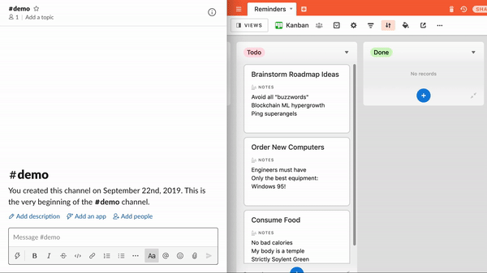
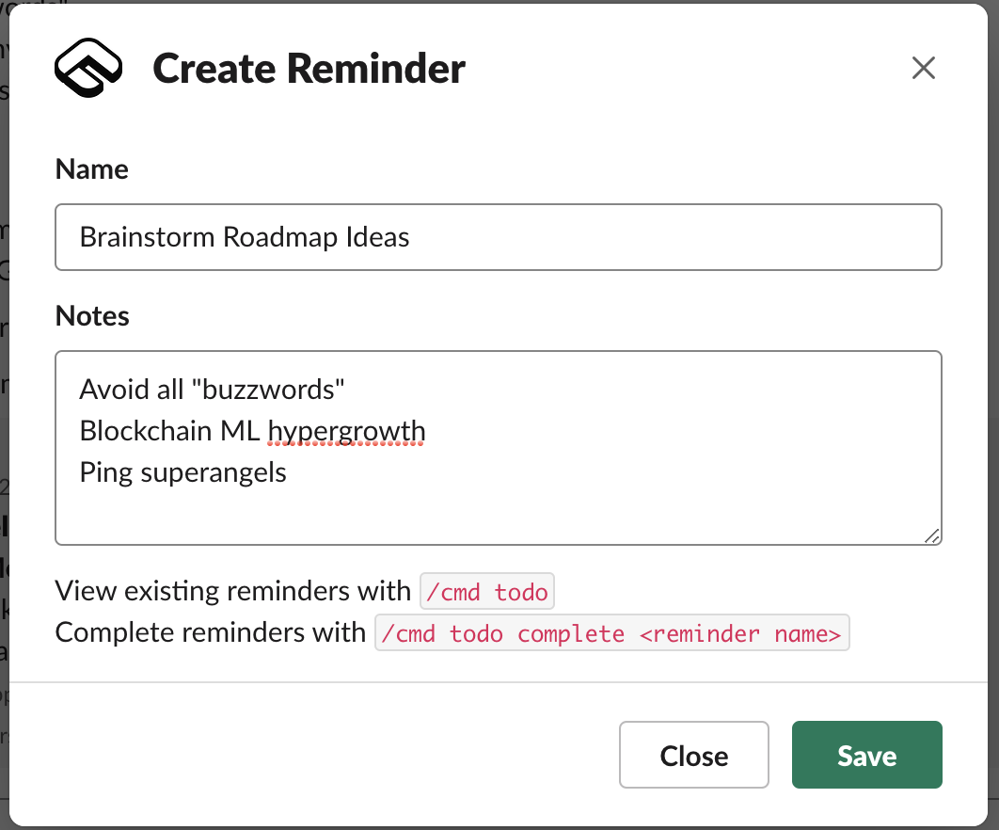
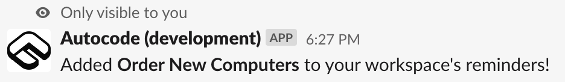
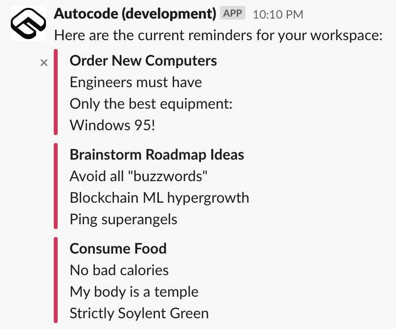
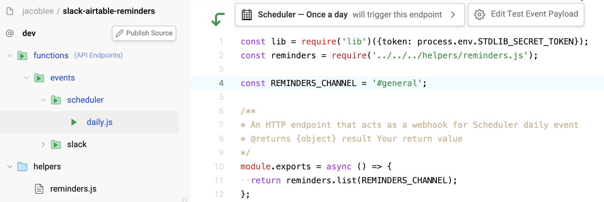
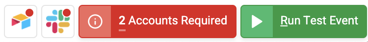
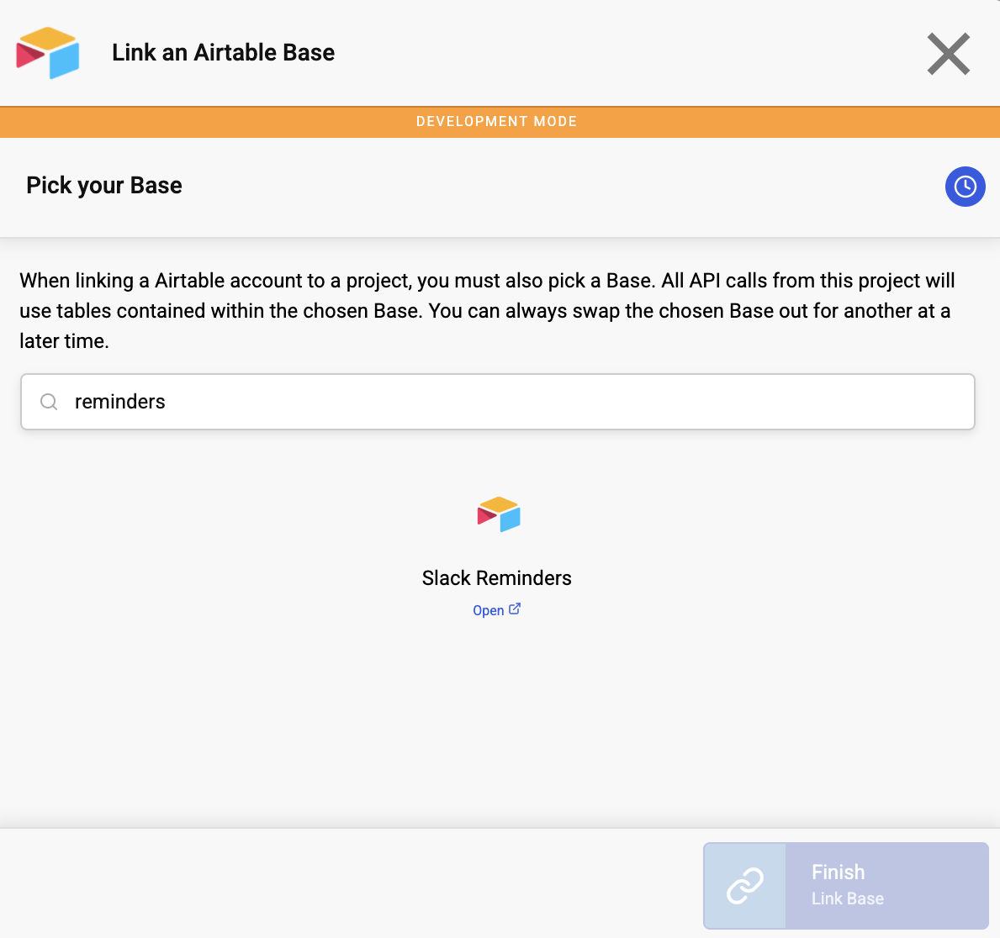
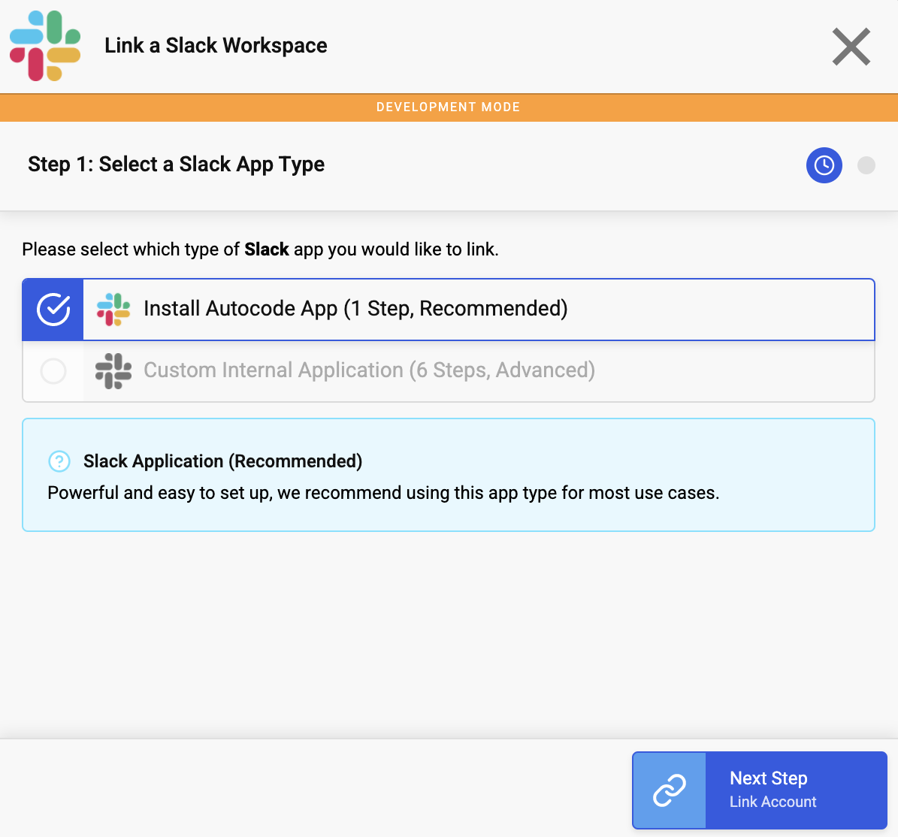
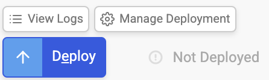

# Build a Slack Reminder Todo App

[](https://open.autocode.com/)

This app allows you to create, list, and clear reminders from your Slack 
workspace using a slash command. It will also send a list of incomplete
reminders every morning at 9am PST!





It uses Airtable both to store the reminders and as a secondary way to manage
and view them. You will need to clone a copy of the premade base to your own 
Airtable workspace by 
[clicking here](https://airtable.com/addBaseFromShare/shrZJn1kSCdGGpMu5).
The base is conveniently set up with a Kanban view for easy management.

# How It Works

This source has three endpoints:

1. `functions/events/slack/command/todo.js`, which responds to incoming
`/cmd todo` commands. This endpoint does most of the heavy lifting - 
depending on what you type after the command, it may open a modal to create a 
reminder, list incomplete reminders, or mark reminders as complete.
2. `functions/events/slack/view_submission.js`, which runs when you submit the
reminder creation modal.
3. `functions/events/scheduler/daily.js`, which runs once a day at 9am PST and
posts a list of incomplete reminders to a designated channel.

There is also a shared `helpers/reminders.js` file outside of the accessible
endpoints that contains some simple code shared across endpoints for querying
incomplete reminders and sending them to a Slack channel.

# Adding Reminders

To add a reminder, run `/cmd todo add`. This will call the `open` method in the
[slack.views API](https://autocode.com/lib/slack/views/#open) on Autocode. That
method opens a modal with a view prompting you to add a name and some reminder 
notes. This app creates the view with a `callback_id` parameter set to
`create-reminder`, which is how Autocode maps it to the `view_submission` 
handler in your project.

Pressing the **Save** button submits the view and calls the aforementioned
`view_submission` handler. This handler parses out the provided values for the
reminder, then calls the `insert` method in the 
[airtable.query API](https://autocode.com/lib/airtable/query/#insert) to insert
the record into your Airtable base with the proper status (as well as storing
the id of the user who first created the reminder):

```
await lib.airtable.query['@0.5.3'].insert({
  table: `Reminders`,
  fieldsets: [
    {
      'Name': nameValue,
      'Notes': notesValue,
      'Slack User Id': event.user.id,
      'Status': 'Todo'
    }
  ]
});
```

On completion, you'll receive an ephemeral message letting you know that you've
successfully created the reminder:



# Listing Reminders

You can see a list of incomplete reminders by running `/cmd todo`.
This will also tag the creators of any incomplete reminders if they were created
via Slack.



# Completing Reminders

Once you've completed a task related to a reminder, you can mark reminders as 
complete by running `/cmd todo complete <reminder name>`. This command is 
case-sensitive, and you'll need the exact reminder name, which you can get via 
`/cmd todo list`.

**Reminder:** You can also manage reminders by changing fields in your Airtable 
base as well!

# Changing the Daily Reminders Channel

The daily reminder from the Autocode scheduler gets sent to the `#general` 
channel by default. If you would like to change this, open your 
`functions/events/scheduler/daily.js` endpoint and change the channel name to
the desired value.



# Forking the Source

[](https://open.autocode.com/)

You can deploy your very own version of this Source by pressing the
**Open in Autocode** button above. Change the name your project if you'd like,
then press the **Fork Source** button.

# Setting Up Your Airtable Reminders Base

The first half of the setup for your reminder app involves setting up the
Airtable base you'll use. First, create your own copy of the premade base by
[clicking here](https://airtable.com/addBaseFromShare/shrZJn1kSCdGGpMu5).

Once you've created your own copy of the base, return to the Autocode editor.
You should see a bouncing red button at the bottom of your screen that says
**2 Accounts Required**:



Press that button, then press the **Link** button in the same row as 
**Airtable**. Press **Link New Resource** and follow the instructions to link 
your Airtable account, then select the base you just copied:



Press **Link Base** and you're done linking your Airtable base!

# Linking Your Slack Workspace

From the account linking modal, press the **Link** button next to the Slack row.
On the next screen, press **Link New Resource**, then select
**Install Autocode App** to get started quickly:



Press **Link Account** and follow the instructions to link your Slack workspace
to your project. You can set a name and custom image for your app if you'd like,
or leave the fields blank to use the defaults.

**Note:** Creating a custom app will allow you to invoke your command as
`/todo`, but requires significant additional setup and permissions 
management.

# Deploying Your App Live

The last thing you'll need to do is press the blue **Deploy** button in the
bottom left corner of the editor:



Press it, and you'll see a progress screen. When it's done, your app will be
live and ready to go!

# That's it!

Thanks for checking out this Source! Follow the Autocode team on Twitter
[@AutocodeHQ](https://twitter.com/AutocodeHQ) for updates. If you have any
questions, please join our community Slack channel - you can get an invite from
under the community tab in the topbar of this page.
